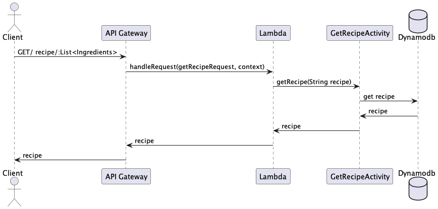
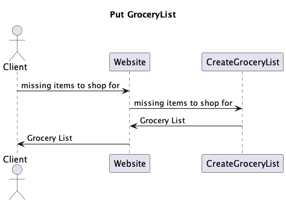

# Dominick's Team Design Document

## Instructions

## *At Home Recipes* Design

## 1. Problem Statement

*Take user input of ingredients they have at home, giving them a list of recipes they can make with said ingredients, so they can cook without having to go to the store.*

## 2. Top Questions to Resolve in Review

1.   how to make an appealing user interface
2.   how to get a list if only part of the ingredients are found

## 3. Use Cases

U1. *As an At Home Recipes customer, I want to `get recipes with the ingredients I already have` when I `list what i have at home`*

U2. *As an At Home Recipes customer, I want to view my saved recipes when I log into the
saved recipes page*
    
U3. *As an At Home Recipes customer, I want to be able to get a list of missing items in the form of a grocery list when I select the grocery list function*

U4. *As an At Home Recipes customer, I want to be able to input preferences for styles of food to cook as part of the input phase*

U5 *As an At Home Recipes customer, I want to be able to get recipes without given allergens*

## 4. Project Scope

### 4.1. In Scope

* Give a list of recipes with the food that were inputted *
* Create a grocery list if customer selects that they are olkay with shopping
* Present a list of saved recipes

### 4.2. Out of Scope

* I will not be worrying about adding hundreds of recipes to the site as would be the case with a fully functioning website.
* I will not be adding a feature for users to add recipes
* No functionality to include allergens or food preferences at this time

# 5. Proposed Architecture Overview

The steps to solving these problems will be as follows : 
1. Build a class and sequence diagram to map how the different classes will work together with the client and the databases
2. Build out the functions to get creat a recipe table, save the recipes to the table, and retrieve recipes according to keywords.
3. create lamda functions that will enable to user to actually interact with the recipes stored in   the database
4. create a website with a user-friendly interface making it easy to input information and retrieve data

# 6. API

## 6.1. Public Models

The `Models` package will contain :
* `RecipeModels` - as a POJO for what a recipe will entail
* `GroceryListModels` - as a POJO for what a grocery list will need

## 6.2. *`Get`/recipe*

*(You should have a separate section for each of the endpoints you are expecting
to build...)*

## 6.3 *`Put`/groceryList*

# 7. Tables

DynamoDb tables : 
* `recipe`
* `groceryList`

# 8. Pages

*User adds all ingredients that they have or desire to use and click the generate recipes button to get a list of recipes*
*User can select the boc under the button to indicate they are okay with going shopping and if they are, the recipes will include a list of ingredients that are needed to make those recipes*
